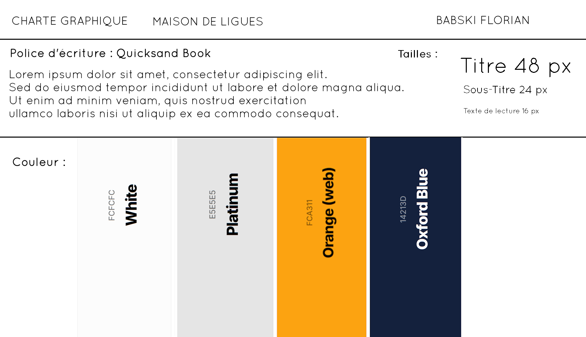

#  Projet Maison des ligues

Lien de la page : [Maison des ligues](https://babskiflorian.github.io/Projet-Maison-des-ligues/index.html)

## Charte graphique :

# Projet "Maison des ligues"

Le projet "Maison des ligues" est une application web dynamique, conçue pour faciliter la gestion et la communication au sein d'une organisation. Développée en HTML, CSS, PHP et JavaScript, cette plateforme offre une expérience utilisateur intuitive et sécurisée, avec des fonctionnalités distinctes pour les utilisateurs standards (collaborateurs) et les administrateurs.

## Les fonctionnalités clés sont les suivantes :

### A. Utilisateur standard (collaborateur) :

*   **Connexion sécurisée :** L'accès à l'application est protégé par un système de login et mot de passe.
*   **Page d'accueil personnalisée :** Une fois connecté, l'utilisateur est accueilli par une page qui affiche un collaborateur au hasard, avec la possibilité d'en découvrir d'autres.
*   **Annuaire des collaborateurs :** Une page liste tous les collaborateurs de l'entreprise sous forme de fiches détaillées, avec des options de filtrage par nom, localisation et catégorie.
*   **Modification du profil :** Chaque utilisateur peut modifier ses informations personnelles, y compris son login et mot de passe, via une page dédiée accessible depuis son image de profil.
*   **Déconnexion sécurisée :** L'utilisateur peut se déconnecter à tout moment, ce qui bloque l'accès aux pages protégées.

### B. Administrateur :

*   **Privilèges étendus :** L'administrateur possède toutes les fonctionnalités de l'utilisateur standard, ainsi que des droits supplémentaires pour gérer les collaborateurs.
*   **Gestion des collaborateurs :** L'administrateur peut ajouter, modifier et supprimer des collaborateurs.
*   **Formulaire d'ajout :** Une page dédiée permet de créer facilement de nouveaux profils de collaborateurs.
*   **Attribution du rôle d'administrateur :** L'administrateur peut également attribuer le rôle d'administrateur à d'autres utilisateurs lors de la modification de leurs informations.

## Langages utilisées

*   **HTML :** Structure et contenu des pages web.
*   **CSS :** Mise en forme et style des pages web.
*   **PHP :** Logique métier et gestion des données côté serveur.
*   **JavaScript :** Interactivité et dynamisme des pages web.

Le projet "Maison des ligues" représente une solution complète et efficace pour la gestion des collaborateurs, offrant une interface conviviale et des fonctionnalités adaptées aux besoins de l'entreprise.