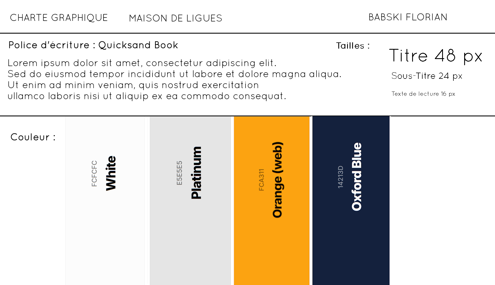
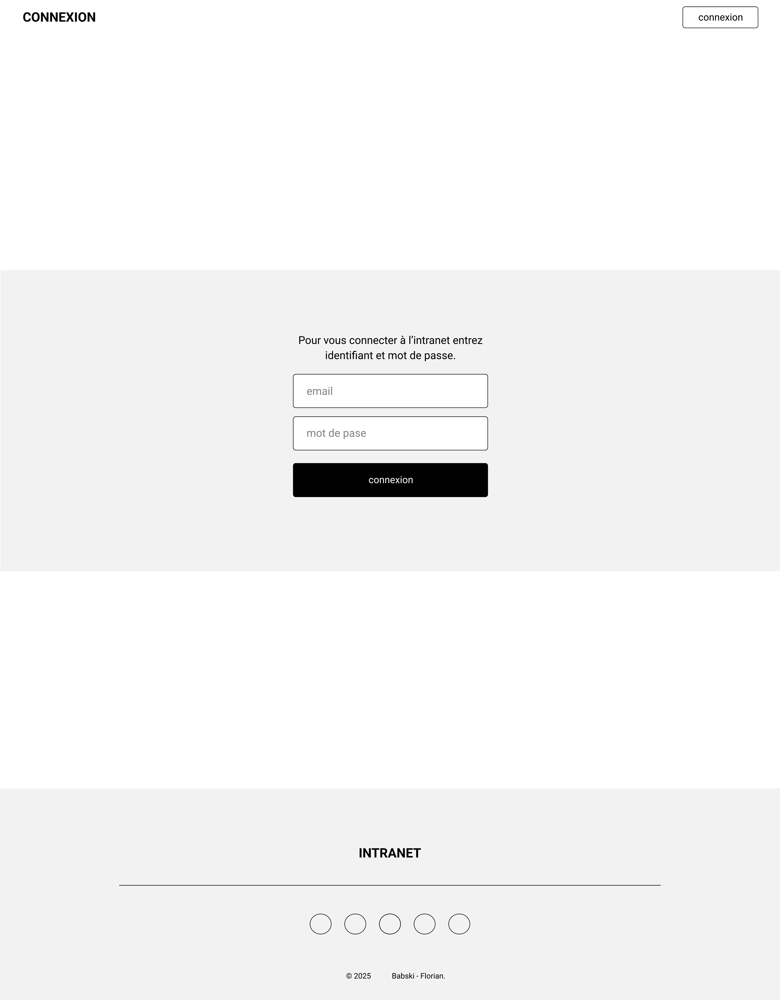
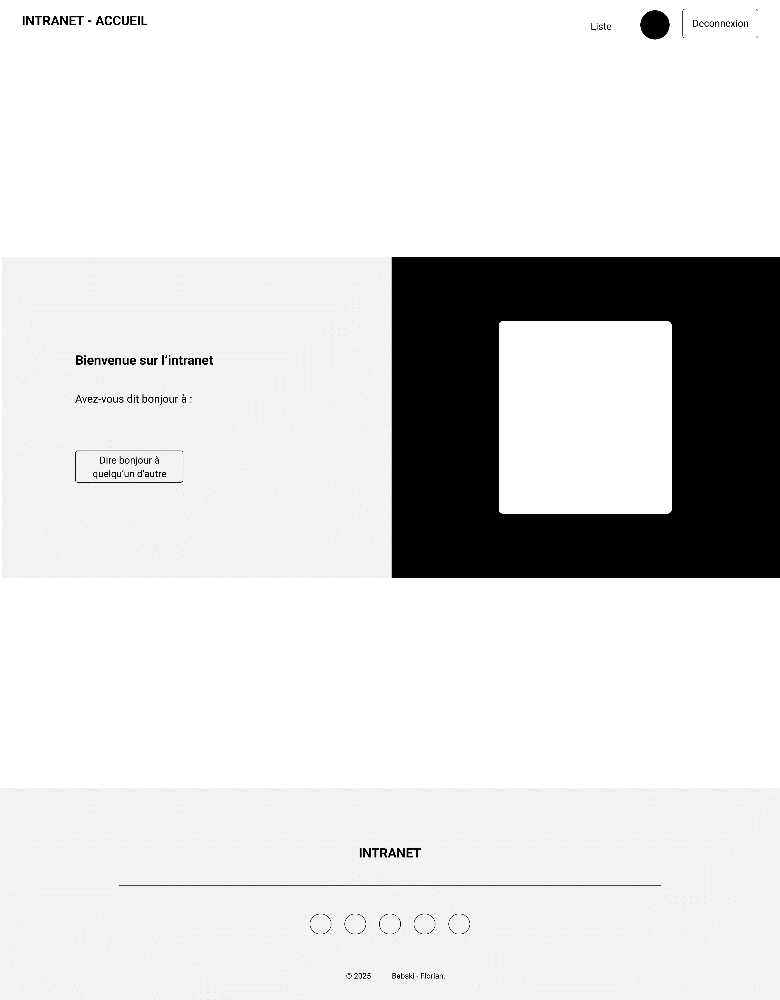
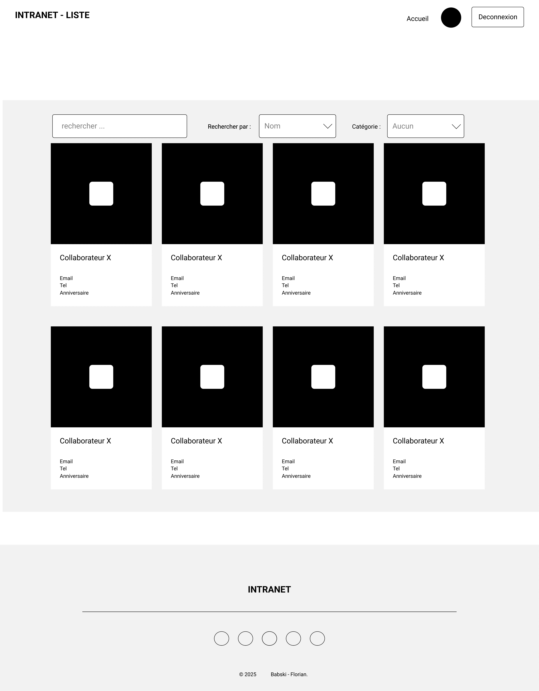
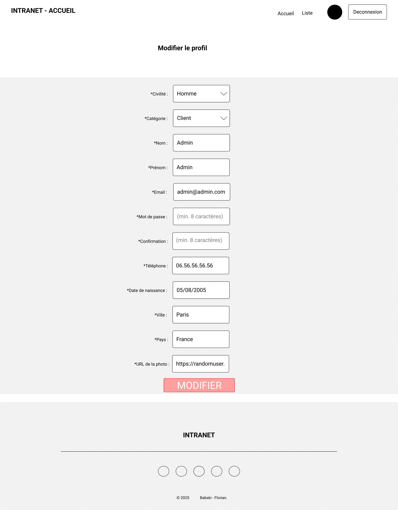
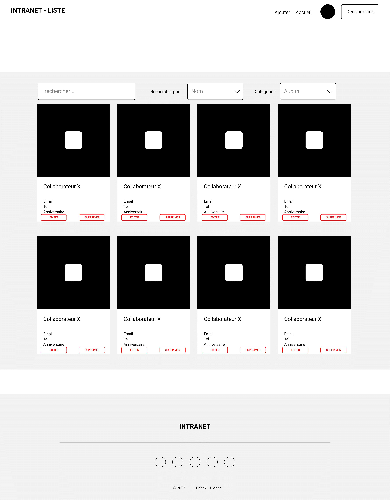

# 📄 Projet : Maison des ligues

## 📌 Lien de la page

*(Projet en local via XAMPP)*

---

## 🎨 Charte graphique

Palette de couleurs : ...

---

## ⚙️ Génération de données de test (script Python)

Un script Python est fourni dans ce projet afin de générer facilement des utilisateurs fictifs pour les besoins de test.  

Le script utilise l’API publique [https://randomuser.me/](https://randomuser.me/) pour récupérer des profils d’utilisateurs aléatoires (données : civilité, prénom, nom, email, téléphone, photo).  

Le fichier généré est un fichier **CSV** qui peut être ensuite importé via la fonctionnalité "Sélectionner un fichier CSV" disponible dans l’interface administrateur de l’application.  

👉 Le mot de passe de chaque utilisateur généré est par défaut "motdepasse" (hashé avec bcrypt par Laravel lors de l’import).

Le script est disponible ici  :  

---

## 👥 Vues Collaborateur

### 1️⃣ Connexion utilisateur

---

### 2️⃣ Page d'accueil personnalisée

---

### 3️⃣ Liste des collaborateurs

---

### 4️⃣ Modification de profil

---

## 🛠️ Vues Administrateur

### 1️⃣ Liste complète des collaborateurs

---

## 1️⃣ Présentation générale

Le projet **Maison des ligues** est une application web dynamique, conçue pour faciliter la gestion et la communication au sein d'une organisation.

- **Objectif** : Créer une plateforme de gestion des collaborateurs et de communication interne pour une organisation ou une entreprise.
- **Contexte** : Projet réalisé dans le cadre de ma formation BTS SIO option SLAM.
- **Période de réalisation** : 05/01/2025 au 24/06/2025
- **Environnement technique** :
  - Système : Windows 11
  - Hébergement : Local en développement (via `php artisan serve`)
  - Serveur web : PHP built-in server (Laravel)
  - Base de données : **MySQL** (via phpMyAdmin)
  - IDE : **Visual Studio Code (VSCode)**
  - Framework PHP : **Laravel**
  - Outils utilisés : **GitHub** (versioning), VSCode (développement)

---

## 2️⃣ Expression des besoins

- **Cibles utilisateurs** : Collaborateurs et administrateurs de l’organisation.
- **Besoins identifiés** :
  - Gestion des profils collaborateurs
  - Gestion des droits d'accès
  - Visualisation de l’annuaire des collaborateurs
  - Sécurisation des données utilisateurs

---

## 3️⃣ Base de données

### 🔸 Modèle de la table `collaborateurs`

| Champ                 | Type                                   | Null | Valeur par défaut | Attributs              |
|-----------------------|----------------------------------------|------|-------------------|-----------------------|
| id_collaborateur      | int(11), clé primaire, AUTO_INCREMENT    | Non  | Aucun             | Identifiant unique    |
| nom                   | varchar(100)                            | Non  | Aucun             |                       |
| prenom                | varchar(100)                            | Non  | Aucun             |                       |
| email                 | varchar(100)                    | Non  | Aucun             | Adresse e-mail unique |
| mot_de_passe          | varchar(255)                            | Non  | Aucun             | Hashé avec bcrypt     |
| civilite              | enum('Monsieur', 'Madame', 'Autre')     | Oui  | NULL              |                       |
| categorie             | enum('Développement', 'Marketing', 'Vente', 'Ressources humaines', etc.) | Oui | NULL              |                       |
| telephone             | varchar(20)                             | Oui  | NULL              |                       |
| date_de_naissance     | date                                    | Oui  | NULL              |                       |
| ville                 | varchar(100)                            | Oui  | NULL              |                       |
| pays                  | varchar(100)                            | Oui  | NULL              |                       |
| photo                 | varchar(255)                            | Oui  | NULL              | URL ou chemin vers la photo |
| est_admin             | tinyint(1) (0 = non admin, 1 = admin)   | Oui  | 0                 | Indique si administrateur |

---

## 4️⃣ Architecture technique

- **Arborescence du projet** (Laravel) :
  - `/app`
  - `/routes`
  - `/resources/views`
  - `/public`
  - `/database`
  - `/config`

- **Architecture** : MVC (Model View Controller) avec Laravel.

---

## 5️⃣ Fonctionnalités développées

### A. Utilisateur standard (collaborateur)

- Connexion sécurisée avec hashage des mots de passe (via bcrypt/Laravel) et gestion des sessions.
- Page d'accueil personnalisée affichant un collaborateur aléatoire.
- Annuaire des collaborateurs avec filtre par nom, localisation et catégorie.
- Modification de son profil utilisateur (login, mot de passe, informations personnelles).
- Déconnexion sécurisée.

### B. Administrateur

- Ajout, modification et suppression de collaborateurs.
- Formulaire d’ajout de nouveaux collaborateurs.
- Attribution du rôle d’administrateur à un autre utilisateur.

---

## 6️⃣ Sécurité

- Gestion des mots de passe : hashage avec **bcrypt** via Laravel.
- Protection contre XSS : Encodage automatique des sorties (Blade Templates).
- Contrôle d’accès : Middleware Laravel pour sécuriser les routes selon le rôle de l’utilisateur.

---

## 7️⃣ Outils et gestion de projet

- **Outils** :
  - **GitHub** (gestion de versions)
  - **Visual Studio Code**
  - **phpMyAdmin** (gestion base de données)
  - XAMPP (MySQL)

- **Méthode de travail** :
  - Organisation personnelle.

---

## 8️⃣ Bilan personnel

- **Compétences acquises** :
  - Utilisation de Laravel MVC
  - Sécurisation des accès
  - Gestion des droits utilisateurs / admins

- **Difficultés rencontrées** :
  - Configuration de Laravel
  - Gestion des migrations de base de données

- **Perspectives d’évolution** :
  - Déploiement sur serveur distant
  - Ajout d’une fonctionnalité de messagerie interne

---

## 9️⃣ Langages et outils utilisés

- **HTML** : Structure des pages
- **CSS** : Mise en forme
- **PHP (Laravel)** : Logique métier et gestion des données
- **JavaScript** : Dynamisme des pages (filtres, formulaires)
- **MySQL** : Base de données
- **Laravel** : Framework PHP MVC
